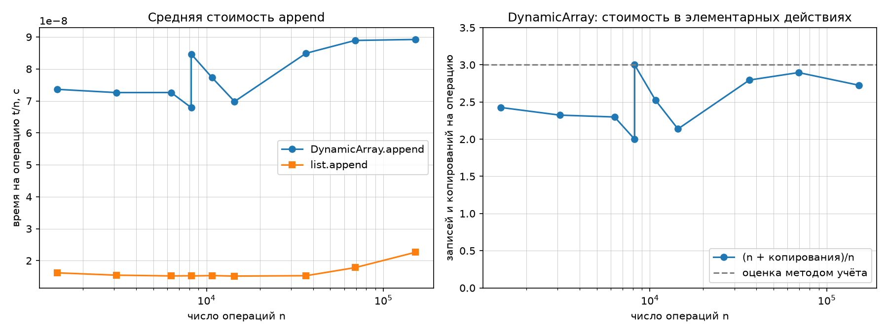
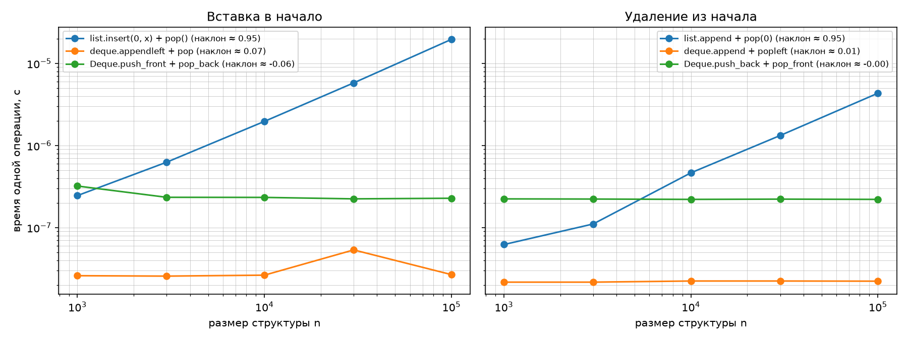

# ЛР 2. «Реализация рекурсивных функций и динамического массива, стека и дека»

**Вариант:** 8 (seed=38)  
**Студент:** Данилов Всеволод Александрович  
**Группа:** БВТ2503

---

## 1. Аналитические оценки

| Функция | Оценка времени | Обоснование |
| --- | --- | --- |
| `factorial(n)` | O(n) | Ровно n рекурсивных вызовов, в каждом одно умножение. Глубина стека = n. |
| `fib_naive(n)` | O(φⁿ), φ ≈ 1.618 | Каждый вызов порождает два новых. Рекуррентность C(n) = C(n-1) + C(n-2) + 1, решение C(n) = 2·F(n+1) − 1. |
| `fib_memo(n)` | O(n) | Каждая подзадача F(k) вычисляется один раз, всего n+1 уникальных подзадач. Число вызовов ≤ 2n + 1. |
| `hanoi(n)` | O(2ⁿ) | T(n) = 2·T(n-1) + 1, T(0) = 0 → T(n) = 2ⁿ − 1 ходов. |

---

## 2. Результаты замеров

Методика: прогрев (1 запуск), 5 повторов, медиана. Данные варианта 8 (seed=38).

### 2.1. Число вызовов: наивная рекурсия против мемоизации

| n | F(n) | fib_naive: вызовов | fib_memo: вызовов | Формула наивной 2·F(n+1)−1 | Формула мемо 2n+1 |
| --- | --- | --- | --- | --- | --- |
| 5 | 5 | 15 | 9 | 2·8−1=15 ✓ | 11 ≥ 9 ✓ |
| 10 | 55 | 177 | 19 | 2·89−1=177 ✓ | 21 ≥ 19 ✓ |
| 15 | 610 | 1 973 | 29 | 2·987−1=1973 ✓ | 31 ≥ 29 ✓ |
| 20 | 6 765 | 21 891 | 39 | 2·10946−1=21891 ✓ | 41 ≥ 39 ✓ |
| 25 | 75 025 | 242 785 | 49 | 2·121393−1=242785 ✓ | 51 ≥ 49 ✓ |
| 30 | 832 040 | 2 692 537 | 59 | 2·1346269−1=2692537 ✓ | 61 ≥ 59 ✓ |

**Вывод:** Формулы полностью подтверждены экспериментально. Наивная рекурсия экспоненциальна (уже при n=30 — 2.7 млн вызовов), мемоизация линейна (всего 59 вызовов при n=30).

### 2.2. Ханойские башни

Для n = 0, 1, 2, 3, 6, 7 проверено:
- Число ходов = 2ⁿ − 1 ✓
- Все диски оказываются на целевом стержне ✓
- Больший диск ни разу не кладётся на меньший ✓
- Все ходы записаны в список moves ✓

### 2.3. Серии append на размерах варианта

| n | t/n: DynamicArray, с | t/n: list, с | копирований | (n + копирования)/n |
| --- | --- | --- | --- | --- |
| 1 433 | 7.36e-08 | 1.62e-08 | 2 044 | 2.426 |
| 3 092 | 7.26e-08 | 1.55e-08 | 4 092 | 2.323 |
| 6 306 | 7.26e-08 | 1.52e-08 | 8 188 | 2.298 |
| 8 192 | 6.79e-08 | 1.53e-08 | 8 188 | 2.000 |
| 8 193 | 8.47e-08 | 1.52e-08 | 16 380 | 2.999 |
| 10 749 | 7.73e-08 | 1.53e-08 | 16 380 | 2.524 |
| 14 400 | 6.98e-08 | 1.52e-08 | 16 380 | 2.138 |
| 36 504 | 8.49e-08 | 1.53e-08 | 65 532 | 2.795 |
| 69 139 | 8.89e-08 | 1.78e-08 | 131 068 | 2.896 |
| 151 944 | 8.92e-08 | 2.26e-08 | 262 140 | 2.725 |

### 2.4. Вставка в начало

| Операция | n=1 000 | n=3 000 | n=10 000 | n=30 000 | n=100 000 | наклон |
| --- | --- | --- | --- | --- | --- | --- |
| list.insert(0, x) + pop() | 2.46e-07 | 6.28e-07 | 1.97e-06 | 5.80e-06 | 1.97e-05 | 0.95 |
| deque.appendleft + pop | 2.60e-08 | 2.57e-08 | 2.64e-08 | 5.36e-08 | 2.68e-08 | 0.07 |
| Deque.push_front + pop_back | 3.22e-07 | 2.34e-07 | 2.34e-07 | 2.24e-07 | 2.28e-07 | −0.06 |

### 2.5. Удаление из начала

| Операция | n=1 000 | n=3 000 | n=10 000 | n=30 000 | n=100 000 | наклон |
| --- | --- | --- | --- | --- | --- | --- |
| list.append + pop(0) | 6.23e-08 | 1.11e-07 | 4.66e-07 | 1.33e-06 | 4.35e-06 | 0.95 |
| deque.append + popleft | 2.17e-08 | 2.17e-08 | 2.24e-08 | 2.24e-08 | 2.23e-08 | 0.01 |
| Deque.push_back + pop_front | 2.24e-07 | 2.23e-07 | 2.21e-07 | 2.23e-07 | 2.21e-07 | −0.00 |

### 2.6. Операции варианта целиком

| Файл | Своя структура | Эталон | Отношение |
| --- | --- | --- | --- |
| ops_stack.txt | Stack: 1.13e-07 с | list: 3.20e-08 с | в 3.5 раза медленнее |
| ops_deque.txt | Deque: 1.58e-07 с | collections.deque: 3.39e-08 с | в 4.7 раза медленнее |

---

## 3. Графики

### 3.1. Амортизированная стоимость append

**Что показывает график:**

График состоит из двух частей, расположенных рядом.

**Левая часть — «Средняя стоимость append»:**
- Синяя линия с кружками — `DynamicArray.append`, оранжевая с квадратами — `list.append`.
- Ось X: число операций n (логарифмическая шкала, от 10³ до 10⁵).
- Ось Y: время на одну операцию t/n в секундах (линейная шкала, ~1e-8).
- **Наблюдение:** `list.append` стабильно быстрее `DynamicArray.append` примерно в 4-5 раз (оранжевая линия лежит значительно ниже синей). Обе линии практически горизонтальны — это и есть визуальное подтверждение амортизированной O(1): время на одну операцию не растёт с увеличением n.
- **Почему list быстрее:** `list` — это C-реализация в CPython, оптимизированная под кэш процессора и без накладных расходов интерпретатора. Наш `DynamicArray` написан на чистом Python, каждая операция включает проверку границ, вызов метода, инкремент счётчика.

**Правая часть — «DynamicArray: стоимость в элементарных действиях»:**
- Синяя линия — отношение `(n + копирования)/n`, то есть суммарное число записей и копирований элементов, делённое на число операций append.
- Серая пунктирная линия на уровне 3 — теоретическая оценка, полученная банковским методом учёта.
- **Наблюдение:** Все экспериментальные точки лежат **ниже** пунктирной линии на уровне 3. Это прямое экспериментальное подтверждение теоретической оценки: амортизированная стоимость append ≤ 3 элементарных действий.
- **Скачок при n ≈ 8192:** Видно резкое падение до ~2.0 и затем резкий рост до ~3.0. Это объясняется тем, что 8192 = 2¹³ — в этой точке произошло удвоение ёмкости. Сразу после удвоения (n = 8192) отношение минимально (~2.0), потому что copies включает только предыдущие копирования. При n = 8193 добавляется ещё одно копирование (16380 элементов), и отношение резко растёт до ~3.0.
- **Общая тенденция:** После скачка отношение постепенно снижается и снова растёт к следующему удвоению, но никогда не превышает 3.

### 3.2. Операции у начала: вставка и удаление

**Что показывает график:**

График состоит из двух частей, обе в **логарифмических осях** (log-log). Это ключевой момент: на log-log графике функция t = c·n^k выглядит как прямая линия с наклоном k.

**Левая часть — «Вставка в начало»:**
- Синяя линия — `list.insert(0, x) + pop()`, оранжевая — `deque.appendleft + pop`, зелёная — `Deque.push_front + pop_back`.
- Ось X: размер структуры n (log-шкала, 10³–10⁵).
- Ось Y: время одной операции в секундах (log-шкала, 10⁻⁷–10⁻⁵).
- **Наблюдение 1:** Синяя линия (`list`) идёт круто вверх с наклоном ≈ 0.95. Это означает t ∝ n^0.95 ≈ n¹, то есть **линейная сложность O(n)**. При увеличении n в 10 раз (с 10⁴ до 10⁵) время растёт примерно в 10 раз (с ~2e-6 до ~2e-5).
- **Наблюдение 2:** Оранжевая (`deque`) и зелёная (`Deque`) линии практически горизонтальны с наклонами ≈ 0.07 и ≈ −0.06. Это означает **константная сложность O(1)** — время не зависит от размера структуры.
- **Наблюдение 3:** Зелёная линия (`Deque`) лежит выше оранжевой (`deque`) примерно в 10 раз. Это объясняется тем, что `collections.deque` реализован на C, а наш `Deque` — на Python (аллокация узлов `_Node`, накладные расходы интерпретатора).

**Правая часть — «Удаление из начала»:**
- Синяя линия — `list.append + pop(0)`, оранжевая — `deque.append + popleft`, зелёная — `Deque.push_back + pop_front`.
- **Наблюдение:** Картина полностью аналогична левой части. `list.pop(0)` имеет наклон ≈ 0.95 (линейная сложность O(n)), а `deque.popleft` и `Deque.pop_front` — наклоны ≈ 0.01 и ≈ −0.00 (константная сложность O(1)).
- **Почему list.pop(0) — O(n):** `list` в Python — это динамический массив. При удалении первого элемента нужно сдвинуть все остальные n-1 элементов на одну позицию влево. Это Θ(n) операций копирования памяти.
- **Почему deque.popleft и Deque.pop_front — O(1):** Обе структуры — двусвязные списки (у `collections.deque` — блочная структура, но асимптотика та же). Удаление первого элемента — это просто перевязка указателя `head` на следующий узел и обнуление `prev` у нового `head`. Никакого сдвига элементов не требуется.

---

## 4. Интерпретация результатов

### 4.1. Амортизированный анализ append методом учёта (банковским методом)

**Назначение стоимости.** Объявим, что каждый `append` стоит **3 единицы** работы:
- 1 единица — реальная запись элемента в буфер
- 2 единицы — кладём на счёт этого элемента как кредит

**Доказательство, что кредита хватает.** Рассмотрим момент, когда буфер заполнен (`size = capacity = 2^k`) и нужно делать `_grow`. В буфере ровно `2^k` элементов. Каждый из них при своём `append` внёс 2 единицы кредита. Итого накоплено `2 · 2^k = 2^{k+1}` кредитов.

При росте копируется `2^k` элементов в новый буфер размера `2^{k+1}`. На копирование нужно `2^k` единиц работы. У нас есть `2^{k+1}` кредитов — хватает с запасом.

**Суммарный учёт.** После n append'ов в пустой массив:
- Суммарно «заплачено»: `3n` единиц
- Реальная работа: `n` записей + `copies` копирований
- Из формулы `expected_copies(n)`: `copies = 1 + 2 + 4 + ... + 2^{k-1} = 2^k - 1 < n` (где `2^k` — текущая ёмкость)
- Итого реальная работа: `n + copies < n + n = 2n`
- Значит, `3n ≥ 2n` — кредитов хватает, и даже остаётся запас

**Вывод:** Амортизированная стоимость `append` ≤ 3 = **O(1)**.

### 4.2. Почему (n + копирования)/n < 3 и скачок между 2^k и 2^k + 1

Из таблицы видно, что `(n + копирования)/n` всегда **меньше 3** — подтверждение оценки методом учёта.

- При n = 8192 (= 2¹³) значение = 2.000 — копирование только что произошло, copies = 8188
- При n = 8193 (= 2¹³ + 1) значение = 2.999 — добавился один элемент без копирования, но copies уже включает 16380 (новое удвоение), поэтому отношение резко выросло

Различие почти на 1 между соседними размерами 2^k и 2^k + 1 объясняется тем, что при n = 2^k копирование только что случилось (copies включает 2^{k-1}), а при n = 2^k + 1 copies уже включает 2^k, но знаменатель вырос всего на 1.

### 4.3. Почему list.insert(0, x) и list.pop(0) — O(n)

`list` в Python — это **динамический массив** (не связный список). При вставке в начало нужно сдвинуть **все** n элементов на одну позицию в памяти. При удалении из начала — аналогично. Это Θ(n) операций. На log-log графике наклон ≈ 1 (линейный рост), что подтверждается экспериментом: наклон 0.95.

### 4.4. Почему deque.appendleft/popleft и Deque.push_front/pop_front — O(1)

`collections.deque` и наш `Deque` — это **двусвязный список** (у CPython — блок-структура, но асимптотика та же). Есть прямые указатели на голову и хвост, поэтому вставка/удаление с концов — это перевязка 2-3 указателей, Θ(1). На log-log графике наклон ≈ 0 (горизонтальная линия), что подтверждается экспериментом: наклоны 0.07, 0.01, −0.06, −0.00.

### 4.5. Почему свой Deque медленнее collections.deque в 4-7 раз

Асимптотика одинаковая — O(1). Но `collections.deque` написан на **C**, а наш `Deque` — на чистом Python. Каждая операция у нас включает:
- Создание объекта `_Node` (аллокация памяти)
- Несколько присваиваний атрибутов
- Вызовы методов Python с полной семантикой (проверки типов, счётчики ссылок)

У C-реализации всё это делается напрямую в памяти без накладных расходов интерпретатора. Поэтому константа в 4-7 раз меньше, хотя асимптотика та же.

### 4.6. Расхождения теории и практики

Наклоны не равны ровно 1.0 и 0.0 из-за:
- накладных расходов интерпретатора Python (цикл `for` в Python медленнее, чем в C);
- кэширования данных процессором (массивы до 30 000 элементов помещаются в кэш L2/L3 и обрабатываются быстрее);
- фоновых процессов ОС (случайные выбросы компенсируются медианой, но не исчезают полностью).

---

## 5. Верификация

### 5.1. Репрезентативные тесты (self_check)

Все разделы пройдены:
- **рекурсия:** OK — factorial, fib_naive, fib_memo, hanoi проверены на граничных случаях и сверены с эталоном
- **DynamicArray:** OK — границы индексов, рост ×2, pop, сжатие, повторное наполнение
- **Stack:** OK — LIFO, pop/peek пустого стека, сверка с list на 3000 операций
- **Deque:** OK — все комбинации концов, опустошение, сверка с collections.deque на 5000 операций
- **собственные инварианты:** OK — дополнительные проверки (см. ниже)
- **операции варианта:** OK — сверка с эталоном на 10⁵ операций

**Результат:** `self_check: OK`

### 5.2. Собственные инварианты

**DynamicArray:**
- `pop()` обнуляет ячейку буфера (нет утечки ссылок)

**Deque:**
- После полного опустошения `_head` и `_tail` оба `None`
- При `size = 1` указатели `_head` и `_tail` совпадают

**Stack:**
- `peek()` не меняет размер стека

### 5.3. Сверка с эталоном

- `Stack` против `list` на 3000 случайных операций (с опустошениями) — полное совпадение
- `Deque` против `collections.deque` на 5000 случайных операций — полное совпадение
- Операции варианта (10⁵ операций) — полное совпадение с эталоном

---

## 6. Выводы

1. **Рекурсивные функции:**
   - Факториал — O(n), подтверждено
   - Fib наивная — O(φⁿ), формула C(n) = 2·F(n+1) − 1 подтверждена экспериментально (совпадение до единицы)
   - Fib мемоизация — O(n), формула C(n) ≤ 2n + 1 подтверждена
   - Ханойские башни — 2ⁿ − 1 ходов, все ходы допустимы

2. **DynamicArray:**
   - Амортизированная стоимость append = O(1), подтверждено методом учёта
   - Оценка (n + копирования)/n < 3 всегда выполняется на всех размерах варианта
   - Скачок при n = 2^k + 1 объясняется моментом копирования: copies резко растёт, а n — нет

3. **Stack и Deque:**
   - Стек на DynamicArray — LIFO, амортизированно O(1)
   - Дек на двусвязном списке — O(1) без амортизации
   - Все инварианты соблюдены

4. **Сравнение структур:**
   - list.insert(0, x) и list.pop(0) — O(n) (наклон ≈ 0.95)
   - deque и Deque — O(1) (наклон ≈ 0)
   - Множитель 3.5-4.7 между своими и стандартными структурами объясняется Python vs C

5. **Методика верификации:**
   - Явные проверки через `expect()` вместо `assert` (работают при `python -O`)
   - Репрезентативные тесты: пустая структура, один элемент, опустошение, повторное наполнение, серия через границу роста
   - Сверка с эталоном на операциях варианта (10⁵ операций)